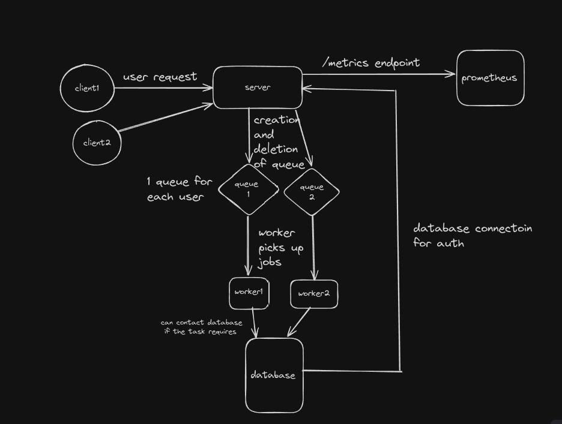
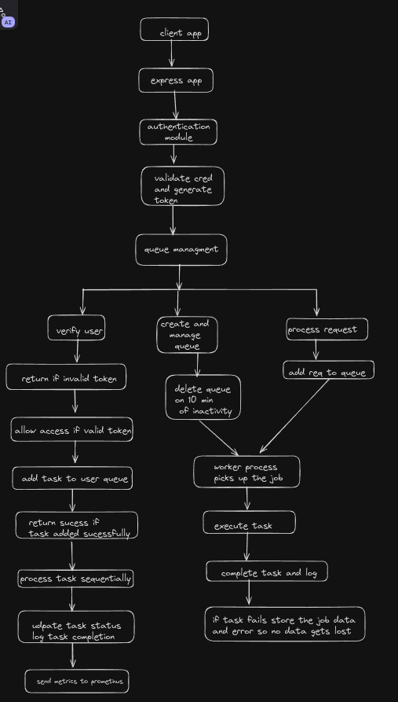

# Backend Queueing System 

## Table of Contents

1. [Introduction](#introduction)
2. [Documentation](#documentation)
3. [Deployment](#deployment)
    - [With Docker](#with-docker)
    - [Without Docker](#without-docker)
4. [Flow Diagrams](#flow-diagrams)
    - [System Flow Diagram](#system-flow-diagram)
    - [Process Flow Diagram](#process-flow-diagram)
5. [Conclusion](#conclusion)

## Introduction
This project represents the backend infrastructure for the Queueing application , a scalable and robust system designed to manage user requests efficiently. 
The backend system incorporates queue management, request processing, authentication, and monitoring functionalities to ensure seamless operation and optimal performance.

## Documentaion
All the documentaion regarding the project is present here
`https://drive.google.com/file/d/1jdn0GEjRTbYh38xT0iPvtoJHy0qUsLGp/view?usp=sharing`

### System Overview
The backend system efficiently manages user requests using a queue structure. Key components include:

- **Authentication Module**: Handles user authentication securely.
- **Queue Management**: Manages queues for each client in a FIFO manner.
- **Request Processing**: Processes requests sequentially from each client's queue.
- **Concurrency Management**: Handles multiple client queues concurrently.
- **Scalability**: Scales to handle increasing users and requests without performance degradation.
- **Robustness**: Implements error handling and recovery mechanisms.
- **Logging and Monitoring**: Provides logging for request handling and uses Prometheus for system monitoring.

### Component Overview
Describes each component's functionality and interaction within the system:
- **Client Interface**: Interacts with the server through API endpoints.
- **Server**: Receives requests, manages queues, and processes requests.
- **Authentication Module**: Handles user authentication and token generation.
- **Queue Management**: Creates and manages queues for each client.
- **Request Processing**: Worker processes that pull and execute tasks from queues.
- **Database**: Stores user data and queue information (MongoDB).
- **Monitoring**: Uses Prometheus for performance metrics monitoring.

## Deployment

### With Docker
To deploy the system using Docker:
1. Clone the repository: `git clone https://github.com/yagyagoel1/gurucool1.git`
2. Navigate to the project directory: `cd gurucool1`
3. Run Docker Compose to start the containers: `sudo docker-compose up`

### Without Docker
For manual deployment without Docker:
1. Clone the repository: `git clone https://github.com/yagyagoel1/gurcool1.git`
2. Navigate to the project directory: `cd gurucool1`
3. Install dependencies: `npm install`
4. Copy the `.env.sample` file and provide the necessary configurations for Redis and MongoDB URLs.
5. Start the server: `npm start`

## Flow Diagrams

### System Flow Diagram

### Process Flow Diagram

